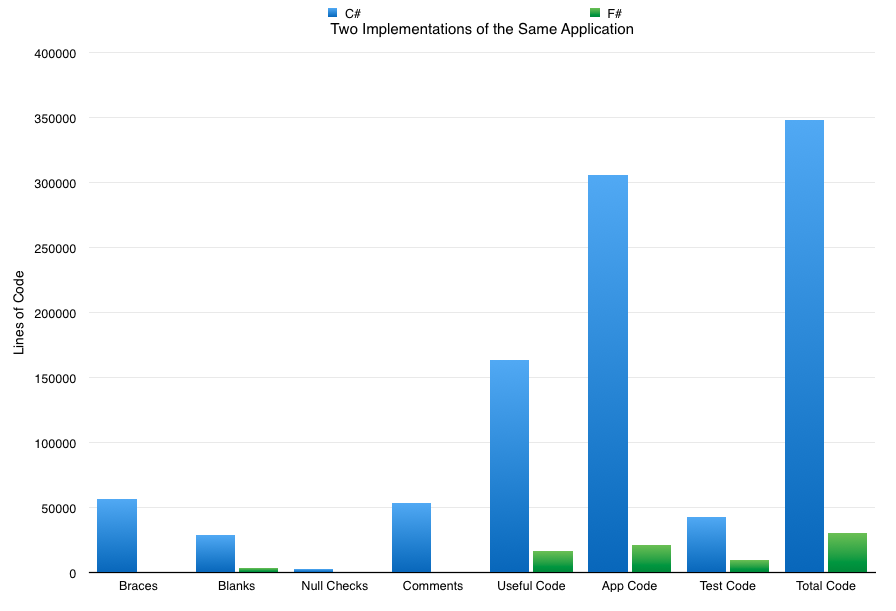
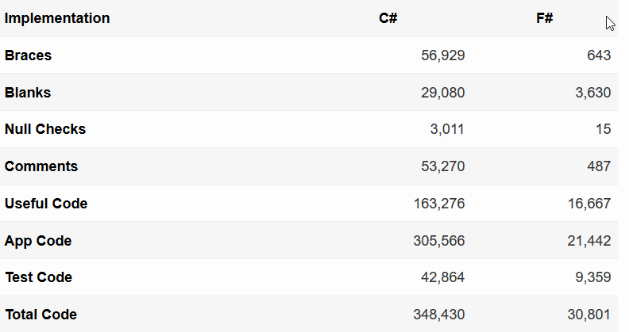
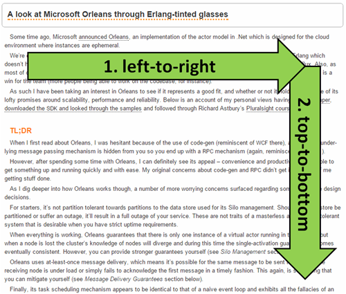
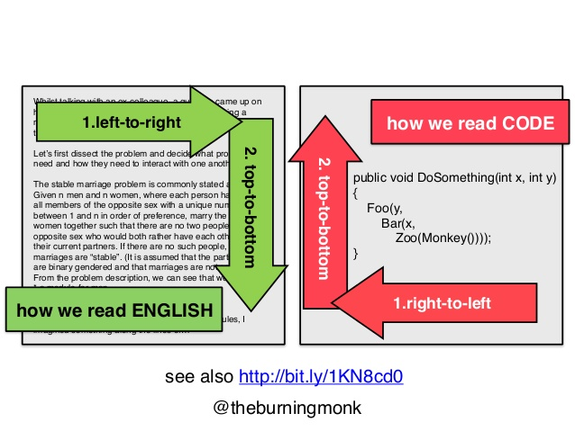
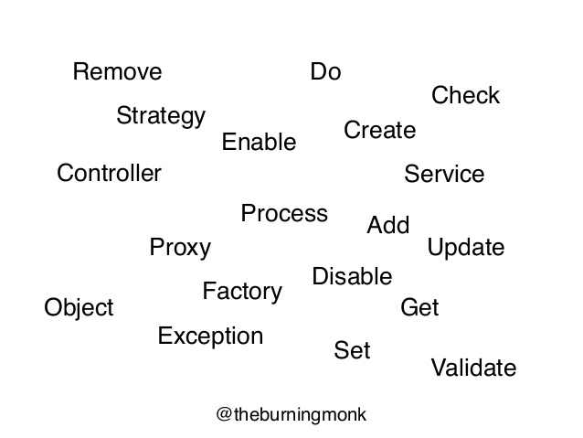

- title : F# und C# im Vergleich
- description : Einführung in F#
- author : Matthias Dittrich
- theme : night
- transition : default

```fsharp
[hide]

type EmailAddress = string
type PostalAddress = string
```

***

### Roadmap

 - **What is F#**
 - A quick introduction
 - Does the language make a difference?
 - What is doing F# differently?
 - Adoption?
 - Challenges?

***

### What is F#

"F# is a mature, open source, cross-platform, functional-first programming language. It empowers users and organizations to tackle complex computing problems with simple, maintainable and robust code."

[fsharp.org](http://fsharp.org/)


---

### What is F#

"F# was so easy to pick up we went from complete novices to having our code in production in less than a week."

> Jack Mott from O’Connor’s Online

[fsharp.org/testimonials](http://fsharp.org/testimonials/)

' O’Connor’s is a law book publisher

---

### What is F#

"Most successful projects I have written have all been in F#."

> Colin Bull, talking about enterprise software

---

### What is F#

- Open Source
- Functional-First -> Imperative, Object Oriented... multi-paradigm
- Less error prone
   - No Nulls by default
   - Stongly typed
   - Units of measure
- Expressive
   - Pattern matching, Records, Tuples, Discriminated Unions
   - Scripting -> Automation (even one-liners)
   - Active Patterns
   - Triple-quoted strings
   - Object expressions

---

### What is F#

- Less Work
   - Don't write what the compiler can figure out
   - Shorter and more generic code -> code reusability
   - Think more on the problem, less on HOW to implement it
   - Quickly try several solutions
- Meta programming
   - Transpiler to Javascript ([FunScript](http://funscript.info/), [Fable](https://github.com/fsprojects/Fable)),  and [GPU code](http://fsharp.org/use/gpu/)
   - Quotations
   - Type providers -> [JSON](http://fsharp.github.io/FSharp.Data/library/JsonProvider.html) (+ REST Apis, [for example WorldBank](http://fsharp.github.io/FSharp.Data/library/WorldBank.html)), [XML](http://fsharp.github.io/FSharp.Data/library/XmlProvider.html), [PowerShell](http://fsprojects.github.io/FSharp.Management/PowerShellProvider.html), [Python](http://fsprojects.github.io/FSharp.Interop.PythonProvider/), ["R"](http://bluemountaincapital.github.io/FSharpRProvider/), [SQL](http://fsprojects.github.io/SQLProvider/), [Registry](http://fsprojects.github.io/FSharp.Management/RegistryProvider.html), [WMI](http://fsprojects.github.io/FSharp.Management/WMIProvider.html), [FileSystem](http://fsprojects.github.io/FSharp.Management/FileSystemProvider.html), [HTML](http://fsharp.github.io/FSharp.Data/library/HtmlProvider.html), [Excel](http://fsprojects.github.io/ExcelProvider/), [CSV](http://fsharp.github.io/FSharp.Data/library/CsvProvider.html)
   - Computation Expressions -> async, sequence, [cloud](http://mbrace.io/programming-model.html), [asyncSeq](http://fsprojects.github.io/FSharp.Control.AsyncSeq/library/AsyncSeq.html) or your [own](https://yaaf.de/blog/post/2016-05-28/Having%20Fun%20with%20Computation%20Expressions)

---

### What is F#

Just another .NET language

' You can replace assembly by assembly
' Interop with all you know from .Net
' Only parts can be in F#


***

### Roadmap

 - What is F#
 - **A quick introduction**
 - Does the language make a difference?
 - What is doing F# differently?
 - Adoption?
 - Challenges?

***

### F# is really simple

```csharp
var t = 5;
```

```fsharp
let u = 5
```

- No semi colons required
- u is immutable by default (a symbol no variable)

---

### F# is really simple

```csharp
public int Add(int a, int b) { 
  return a + b;
}
```

```fsharp
let add a b =
  a + b
```

- No return keyword, last value is returned.
- No types needed, compiler will figure it out.
- No start- and end-brace is needed, whitespace counts.


---

### F# is really simple

```csharp
public class Person {
  public string Name { get; } // C#7
  public Person(string name) { Name = name; }
}
```

```fsharp
type Person (name:string) =
  member x.Name = name
```

- No start- and end-brace is needed, whitespace counts.
- Single constructor by default (helps you design better classes)
- Constructor parameters are private fields out of the box

---

### F# is really simple

```csharp
public interface IPerson {
  public string Name { get; }
}
```

```fsharp
type IPerson =
  abstract Name : string
```

- Interface = Type without implementations and without constructor
- You can do everything you would expect: abstract classes, namespaces, public, private, internal, ...

---

### Discriminated unions and pattern matching

```fsharp
type Fruit =
  | Apple of radius:int
  | Banana of length:int

let printFruit fruit =
  match fruit with
  | Apple radius -> sprintf "a tasty apple with radius %d" radius
  | Banana length -> sprintf "banana with size %d" length
```

- C#: 3 classes are required (abstract base class Fruit, Apple, Banana)
- Visitor pattern
- Equality members
- Documentation
- printFruit is another class (the visitor)


---

### F# is simple: Match = switch on steroids

```csharp
var a = o as A;
if (a != null)
{ 
   //... 
}
var b = o as B;
if (b != null && someCondition)
{
   // ...
}
```

```fsharp
match o with
| :? A as a -> //...
| :? B as b when someCondition -> //...
```

---

### F# is simple: Consistent syntax

```csharp
try {
  // ...
} 
with (AException a) {
  // ...
}
with (BException b) {
  if (!someCondition) throw;
  // ...
}
```

```fsharp
try
  // ...
with
| :? AException as a -> //...
| :? BException when someCondition -> //...
```

---

### F# is simple: Records

```csharp
public class Person {
  public string Name { get; }
  public string Address { get; }
  public Person(string name, string address) {
    Name = name; Address = address } }
```

```fsharp
type Person =
  { Name : string; Address : string option }

let createPerson name = { Name = name; Address = None }
let printPerson p =
    match p with
    | { Name = "Lars" } -> "the boss"
    | _ -> p.Name
```

- Equality members.
- Pattern matching.
- Immutable by default.

***

### Roadmap

 - What is F#
 - A quick introduction
 - **Does the language make a difference?**
 - What is doing F# differently?
 - Adoption?
 - Challenges?

***

### Does the language make a difference?

- The tools we use have a profound (and devious!) influence on our thinking habits, and, therefore, on our thinking abilities. 
- The use of COBOL cripples the mind; its teaching should, therefore, be regarded as a criminal offence. 

> [Edsger W. Dijkstra](http://www.cs.virginia.edu/~evans/cs655/readings/ewd498.html)

---

### Does F# make a difference?

What [do people say](http://simontylercousins.net/does-the-language-you-use-make-a-difference-revisited/) about C# and F#?

- Real enterprise system
- Two different teams
- Same set of contracts, complex contracts
- Analysis afterwards

' Simon Cousins
' Rare occation where this happens
' big company in the energy sector
' You will see these numbers in several talks about F#

---

### Does F# make a difference?



---

### Does F# make a difference?



---

### Does F# make a difference?

 - The C# project took five years and peaked at ~8 devs. It never fully implemented all of the contracts.
 - The F# project took less than a year and peaked at three devs (only one had prior experience with F#). All of the contracts were fully implemented.

[F# makes a difference](http://simontylercousins.net/does-the-language-you-use-make-a-difference-revisited/)

' C# Solution was too complex and could never implement all contracts
' They simplified the contracts but never managed to get it correct
' C# Solution was slow

***

### Roadmap

 - What is F#
 - A quick introduction
 - Does the language make a difference?
 - **What is doing F# differently?**
 - Adoption?
 - Challenges?
 
***

### What is doing F# differently?

- Layout, Readability
- Naming
- Understandable and Expressiveness
- Abstractions

***

### Layout: Whitespace

```csharp
public int Method() {
    return 3;
}
```

Or

```csharp
public int Method ()
{
    return 3;
}
```

Two competing rules in C-like languages

---

### Layout: Whitespace

There should be one - and preferable only one - obvious way to do it.

> [the Zen of Python](https://www.python.org/dev/peps/pep-0020/)

---

### Layout: Whitespace


<table style="width:100%">
  <tr>
    <th>Language</th>
    <th>Compiler</th>
    <th>Human</th>
  </tr>
  <tr>
    <td>C#</td>
    <td>{}</td>
    <td>{} and whitespace</td>
  </tr>
  <tr>
    <td>F#</td>
    <td>whitespace</td>
    <td>whitespace</td>
  </tr>
</table> 

---

### Layout: Structure

```csharp
public ResultType MyClevermethod(
    int firstArg,
    string secondArg,
    string thirdArg)
{
    var localVar =
        AnotherCleverMethod(firstArg, secondArg);
    if (localVar.IsSomething(
        thirdArg, MY_CONSTANT))
    {
        DoSomething(localVar);
    }
    return localVar.GetSomething();
}
```

---

### Layout: Structure

```
XXXXXX XXXXXXXXXX XXXXXXXXXXXXXXX
    XXX XXXXXXXXX
    XXXXXX XXXXXXXXXX
    XXXXXX XXXXXXXXX

    XXX XXXXXXXX 
        XXXXXXXXXXXXXXXXXXXXXXXXXXXXX XXXXXXXXXXX
    XX XXXXXXXXX XXXXXXXXXXXX
        XXXXXXXXX XXXXXXXXXXXXX
    
        XXXXXXXXXXXXXXXXXXXXXX
    
    XXXXXX XXXXXXXXX XXXXXXXXXXXXXX
```

' Single characters are removed
' Where does the body start?
' What about incorrect whitespace?
' Mixed tabs and spaces?

---

### Layout: Structure

```fsharp
let myClevermethod x y y =
    let localVar = anotherCleverMethod x y

    if localVar.IsSomething z MY_CONSTANT then
        doSomething localVar
    
    localVar.GetSomething
```

---

### Layout: Structure

```
XXX XXXXXXXXXXXXXX
    XXX XXXXXXXX XXXXXXXXXXXXXXXXXXX

    XX XXXXXXXX XXXXXXXXXXX XXXXXXXX XXXXXXXXXXX XXXX
        XXXXXXXXXXX XXXXXXXX

    XXXXXXXX XXXXXXXXXXXX
```

' Code blocks can be seen -> enforced by the compiler
' return value is the last line (no return within the function code)

---

### Layout: Structure



---

### Layout: Structure



---

### Layout: Structure

```fsharp
let doSomething x y =
    Monkey()
    |> zoo
    |> bar x
    |> foo y
```


***

### Naming

"There are only two hard things in Computer Science: cache invalidation and naming things."

> Phil Karlton

"Names are the one and only tool you have to explain what a variable does in every place it appears, without having to scatter comments everywhere."

> Mike Mahemoff

---

### Lego Naming



[methodnamer.com](http://methodnamer.com/)

' Github search FactoryFactory -> 3154 results, 1000 for java.

---

### Naming: Higher Order Functions

```fsharp
words
|> Array.map (fun x -> x.Count)
|> Array.reduce (+)
```

- Smaller scopes
- Shorter names ([When x, y, z are great variable names](http://blog.ploeh.dk/2015/08/17/when-x-y-and-z-are-great-variable-names/))
- Fewer things to name

---

### Naming: Short names

"The length of a name should be related to the length of the scope. You can use very short variable names for tiny scopes, but for big scopes you should use longer names."

> **Clean Code**: Robert C. Martin

---


### Naming: Smaller than object?

```csharp
public interface IConditionChecker
{
    bool CheckCondition();
}
```
```csharp
public interface ICondition
{
    bool IsTrue();
}
```

---

### Naming: Smaller than object?

```fsharp
type Condition = unit -> bool
```
```csharp
using Condition = System.Func<System.Boolean>;
```

No abstraction is too small.

' C# Not exported as 'real' type
' C# Needs to be written in all files

---

### Naming: Object expressions

```fsharp
enterpriseCrew.OrderBy(
  (fun c -> c.Current),
  { new IComparer<Occupation> with
      member __.Compare(x, y) =
        x.Position.CompareTo(y.Position) })
```

- No need to define a class, no need to name it.
- `_` and `__` used  to explicitly give something no name.

' Perfectly reasonable in F# to abstract things in interfaces
' Sometimes they don't even have a class, because you create them by combining and wrapping via functions

***

### Understandable and Expressiveness

```csharp
public void DoProcess() {
   for (int i = 0; i < this.Processes.Count; i++) {
      this.Results[i] = this.Processes[i].Calculate();
      if (this.Results[i].Status == Status.Failed) {
        return;
      }
   }
}
```

---

### Understandable and Expressiveness

```fsharp
let calculateUntilFail processes =
  processes
  |> Seq.map (fun p -> p.Calculate())
  |> Seq.takeWhile (fun r -> r.Status <> Status.Failed)
  |> Seq.toList
```

' pure: Same parameters, same results
' side effect free
' easier to reason about
' less error prone (array indices,  ...)

---

### Expressiveness: "Everything" is an expression

```csharp
var variable = null;
try {
  variable = TrySomethingRisky()
} with (AException) {
  variable = fallback1;
} with (BException) {
  variable = fallback2;
}
return DoSomething(variable);
```

```fsharp
let symbol =
  try
    TrySomethingRisky()
  with
    | :? AException -> fallback1
    | :? BException -> fallback1
DoSomething(symbol)
```

---

### Expressiveness: "Everything" is an expression

```fsharp
let symbol =
  try
    TrySomethingRisky()
  with
    | :? AException -> fallback1
    | :? BException -> fallback1
symbol
```

```fsharp
try
  TrySomethingRisky()
with
  | :? AException -> fallback1
  | :? BException -> fallback1
|> DoSomething
```

- No need to name the thing.

---

### Expressiveness: "Everything" is an expression

```csharp
var variable = condition ? Value1 : fallback;
```

```fsharp
let variable = if condition then Value1 else fallback
```

---

### Single pass compiler

DEMO

---

### Expressiveness: Type provider

DEMO


---

### Expressiveness: Computation Expression

```fsharp
async {
    let! results =
        [ "http://www.mbrace.io/"
          "http://www.nessos.gr/" ]
        |> List.map downloadAsync
        |> Async.Parallel

    return results |> Array.sumBy(fun r -> r.Length)
}
```

Like async/await in C# but the concept behind is more powerful.

---


### Expressiveness: Computation Expression

```fsharp
let downloadCloud url = downloadAsync url |> Cloud.OfAsync

cloud {
    let! results =
        [ "http://www.mbrace.io/"
          "http://www.nessos.gr/" ]
        |> List.map downloadCloud
        |> Cloud.Parallel

    return results |> Array.sumBy(fun r -> r.Length)
}
```

> [mbrace](http://mbrace.io/programming-model.html)

***

### Abstractions

"Your abstractions should afford right behaviour, whilst make it impossible to do the wrong thing."

"Make illegal states unrepresentable."

---

### Abstractions: make illegal states unrepresentable

Business rules:

- A contact has a name.
- A contact has an address.
  - an email address
  - a postal address
  - both

---

### Abstractions: make illegal states unrepresentable

```csharp
public class Contact {
  public string Name { get; }
  public EmailAddress EMail { get; }
  public PostalAddress Address { get; }
  public Contact(string name, EmailAddress email, 
      PostalAddress address) {
    if (email == null && address == null)
      throw new ArgumentException("Invalid!");
    Name = name;
    EMail = email;
    Address = address; 
}
``` 

' Runtime error only.
' Needs unit test.
' Caller might not handle the null case (sample data / tests all contain email address).

---

### Abstractions: make illegal states unrepresentable

```fsharp
type ContactInfo = 
    | EmailOnly of EmailAddress
    | PostOnly of PostalAddress
    | EmailAndPost of EmailAddress * PostalAddress

type Contact = { Name : string; ContactInfo : ContactInfo } 
```

' No Nulls.
' Caller needs to exlicitly handle all cases.
' Compiler error instead of runtime error.
' Assumes `EmailAddress` and `PostalAddress` are defined in F# as well

***

### Roadmap

 - What is F#
 - A quick introduction
 - Does the language make a difference?
 - What is doing F# differently?
 - **Adoption?**
 - Challenges?

***

### Adoption?

Low risk

- Runs on CLR, mono and the new "CoreCLR"
- Open Source
- Good Interop
- Back-out to C#

> [@simontcousins](http://www.slideshare.net/simontcousins/time-for-functions)

---

### Adoption?

- Self taught
- Hire .NET developers, not language X
- Production code in a week
- Functional programmer in a month

> [@simontcousins](http://www.slideshare.net/simontcousins/time-for-functions)

---

### Adoption?

- Baby steps: Don't try to introduce a new language and a new paradigm
- Language first: Explicit interfaces, Syntax, Records vs Classes vs Modules
- Paradigm second: Let the language guide you

> [Colin Bull](https://skillsmatter.com/skillscasts/7430-enterprise-f-sharp)

---

### Adoption?

- Start with Build
- msbuild is not fun
- FAKE

> [Colin Bull](https://skillsmatter.com/skillscasts/7430-enterprise-f-sharp)

' Well understood problem
' Imperative

***

### Roadmap

 - What is F#
 - A quick introduction
 - Does the language make a difference?
 - What is doing F# differently?
 - Adoption?
 - **Challenges?**

***

### Challenges?

- People are too puritanical about purity.
  
  - be pragmatic and solution focused 
  - functional purity not for the sake of itself

---

### Challenges?


> [XKCD](https://xkcd.com/1270/) 

---

### Challenges?

- Explicit is better than implicit.
- Simple is better than Complex. Complex is better than Complicated.
- Special cases aren't special enough to break the rules.
  Although practicality beats purity.
- If the implementation is hard to explain, it's a bad idea.

> [the Zen of Python](https://www.python.org/dev/peps/pep-0020/)

' F# type inference, sometimes explicit type annotations make sence: Example public interfaces.
' There is no efficient pure dictionary -> use mutability for well understood core structures.
' Trick encapsulate away the state.

---

```fsharp
let memoize f =
  let cache = System.Collections.Generic.Dictionary<_, _>()
  fun x ->
    if cache.ContainsKey(x) then cache.[x]
    else let res = f x
         cache.[x] <- res
         res

let somePureLongRunningFunc i =
  System.Threading.Thread.Sleep (2000)
  i + 1

let fastFunc = memoize somePureLongRunningFunc
```

' No reason to use a slow functional dictionary
' Caller should save the returned function (encapsulates the state)
' Perfect combination of mutable state and functional ideas

***


### AIT, challenge yourself!

- "Practice does not make perfect. Only perfect practice makes perfect"
- "Perfection is not attainable. But if we chase perfection, we can catch excellence"

> Vince Lombardi

---

### AIT, challenge yourself!

- "Programming languages have a devious influence: They shape our thinking habits."

> Edsger W. Dijkstra

- "One of the most disastrous thing we can learn is the first programming language, even if it's a good programming language."

> Alan Kay

***

### Thanks (and things to read/watch in depth)

 - [7 ineffective coding habits many F# programmers don't have](http://www.slideshare.net/theburningmonk/7-ineffective-coding-habits-many-f-programmers-dont-have/70-theburningmonkStrategyProcessCreateAddControllerFactoryProxyObjectExceptionEnableDoDisableServiceRemoveCheckGetSetUpdateValidate)
 - [Does the language make a difference](http://simontylercousins.net/does-the-language-you-use-make-a-difference-revisited/)
 - [FSReveal (but really the whole F# community)](http://fsprojects.github.io/FsReveal/index.html)
 - [Real world functional programming](https://msdn.microsoft.com/en-us/library/hh314518(v=vs.100).aspx)
 - [Luca Bolognese](https://channel9.msdn.com/Blogs/pdc2008/TL11)
 - [Enterprise F#](https://skillsmatter.com/skillscasts/7430-enterprise-f-sharp)

 
***

### Bonus: FAKE

DEMO (these slides)

***

### Bonus: Paket


---

### Bonus: Paket

- Not a simple NuGet.exe replacement
- Package via csproj/fsproj (no nuspec needed)
- GitHub and Http (file based) dependencies.
- Caching
- Git dependencies (repository -> temporary replace nuget dependency)
- Support for most stuff (Roslyn Analyzers, Content files, ...)
- Doesn't support PowerShell scripts (by design)
